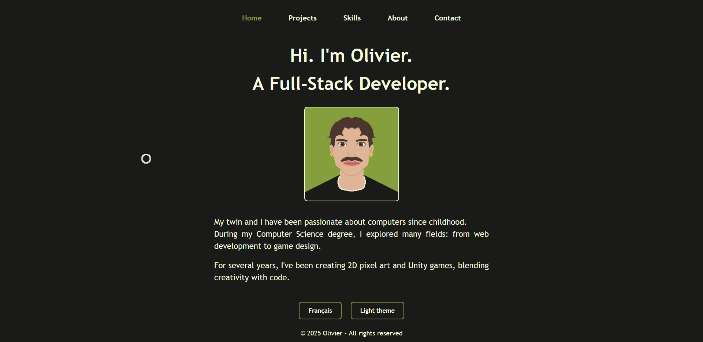

# Portfolio-Website
This is a showcase website that serves as a personal developer portfolio, built using HTML, CSS, JavaScript, and PHP. It includes a homepage, a page presenting my skills, an « About » page featuring my resume, a contact page with a form, a project listing page with a filter allowing sorting by different categories (none, academic, or personal), a page with detailed information about each project, and a page that lets users play a game directly via a WebGL link when available. The design is based on a general stylesheet, complemented by specific CSS files for each page. The website is bilingual, with the ability to switch between French and English, and includes a button to toggle between light and dark themes, which also affects the resume display. Two dedicated JavaScript files manage the language and theme features. The site is designed to be easily maintainable: adding new content simply requires inserting a new entry into an array within the scripts/data.php script. I paid close attention to both functionality and visual presentation to achieve a professional and user-friendly result.

# Instructions
Link : http://oliviercochard.myartsonline.com

# Images
<table>
	
  <tr>
  	<td></td>
    <td></td>
    <td></td>
  </tr>
</table>